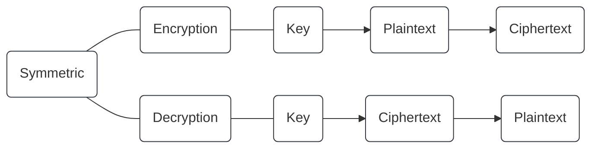

### Usage
|Classes|Functions|Parameters|
|:-:|:-:|:-:|
||`key`|`symbols` `start` `stop`|
|`Symmetric`|`encrypt_string` `decrypt_string`|`plaintext` `ciphertext`|
### Visualization

```mermaid
graph LR;1(Symmetric)---2(Encryption)---3(Key)-->4(Plaintext)-->5(Ciphertext);1(Symmetric)---6(Decryption)---7(Key)-->8(Ciphertext)-->9(Plaintext)
style 1 fill:#00000000,stroke:#30363d
style 2 fill:#00000000,stroke:#30363d
style 3 fill:#00000000,stroke:#30363d
style 4 fill:#00000000,stroke:#30363d
style 5 fill:#00000000,stroke:#30363d
style 6 fill:#00000000,stroke:#30363d
style 7 fill:#00000000,stroke:#30363d
style 8 fill:#00000000,stroke:#30363d
style 9 fill:#00000000,stroke:#30363d
```